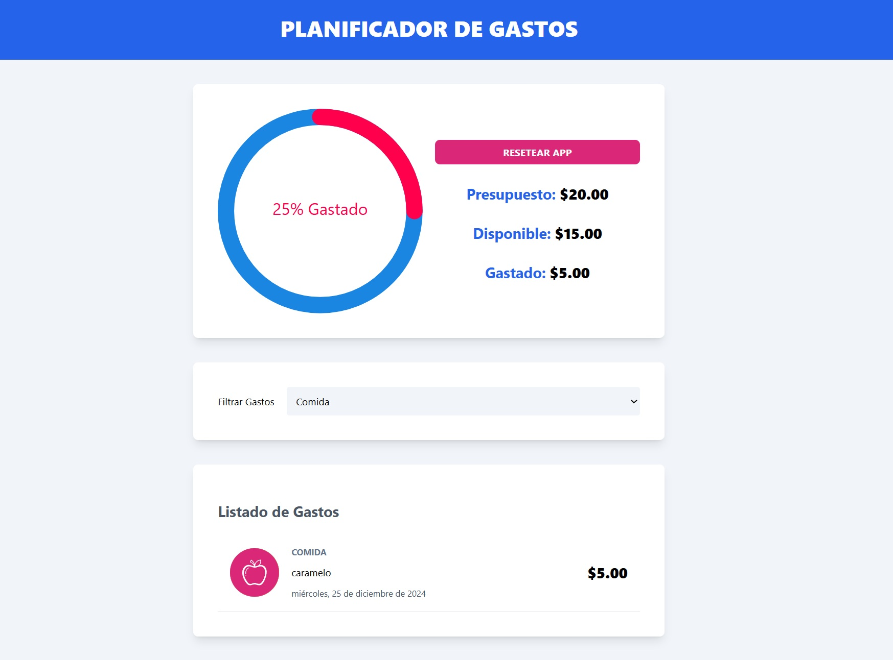

# Control de Gastos

Aplicacion desarrollada para el control de gastos, en el cual inicialmente se define un presupuesto, habilitando la vista
del componente en donde se visualiza el control de los gastos en porcentaje mediante una esfera. Los gastos se aprecian en forma de lista, donde se destacan 
por la categoria, nombre y fecha del mismo. Se pueden filtrar estos gastos mediante un select.

## Características

- Se utiliza `useContext` para un estado global.
- Para las acciones y modificación de los distintos states, se utiliza `useReducer`.
- El proyecto está desarrollado con `TypeScript` y `React`.

## Vista previa del proyecto

